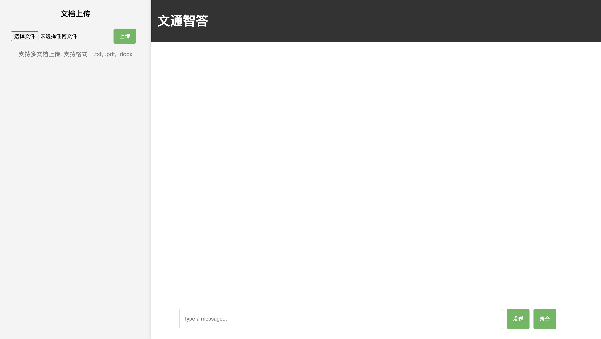

# 文通智答

[文通智答](https://github.com/Invariant64/doc-ai)是一个基于智谱平台的智能问答系统, 用户可以通过输入问题, 获取智谱平台的知识图谱中的答案.

文通智答基于Python Flask框架开发, 前端使用HTML, CSS和JavaScript, 并通过SDK调用智谱平台的API.



## 项目结构

```
.
├── README.md
├── index.html
├── script.js
├── style.css
├── main.py
└── requirements.txt
```

## 安装依赖

1. 安装Python3.9
2. 安装依赖库
```shell
pip install -r requirements.txt
```
3. 将智谱平台的API KEY存入环境变量中
```shell
export ZHIPU_API_KEY=your_api_key
```

## 使用方法

1. 启动后端服务
```shell
python main.py
```
2. 在浏览器中打开`index.html`文件

## 基于智谱AI SDK的开发

### 安装SDK

```shell
pip install zhipuai
```

### 模型调用

#### 创建client

在调用API之前, 需要创建一个`ZhipuAI`对象, 并传入API KEY
  
```python
from zhipuai import ZhipuAI
client = ZhipuAI(api_key="") # 请填写您自己的APIKey
```

为了API KEY的安全, 可以将API KEY存入环境变量中, 并通过`os`模块获取

```python
import os
from zhipuai import ZhipuAI
api_key = os.getenv("ZHIPU_API_KEY")
client = ZhipuAI(api_key=api_key)
```

#### 同步调用

通过同步的方式调用模型, 调用后可以一次性获得返回的结果, 但是需要等待的时间较长.

```python
from zhipuai import ZhipuAI
client = ZhipuAI(api_key="") # 填写您自己的APIKey
response = client.chat.completions.create(
  model="glm-4",  # 填写需要调用的模型名称
  messages=[
    {"role": "user", "content": "作为一名营销专家，请为智谱开放平台创作一个吸引人的slogan"},
    {"role": "assistant", "content": "当然，为了创作一个吸引人的slogan，请告诉我一些关于您产品的信息"},
    {"role": "user", "content": "智谱AI开放平台"},
    {"role": "assistant", "content": "智启未来，谱绘无限一智谱AI，让创新触手可及!"},
    {"role": "user", "content": "创造一个更精准、吸引人的slogan"}
  ],
)
print(response.choices[0].message)

```

#### 流式调用

通过流式的方式调用模型, 可以在生成的内容较多时, 逐步获取返回的结果.

```python
from zhipuai import ZhipuAI
client = ZhipuAI(api_key="") # 请填写您自己的APIKey
response = client.chat.completions.create(
    model="glm-4",  # 填写需要调用的模型名称
    messages=[
        {"role": "system", "content": "你是一个乐于解答各种问题的助手，你的任务是为用户提供专业、准确、有见地的建议。"},
        {"role": "user", "content": "我对太阳系的行星非常感兴趣，特别是土星。请提供关于土星的基本信息，包括其大小、组成、环系统和任何独特的天文现象。"},
    ],
    stream=True,
)
for chunk in response:
    print(chunk.choices[0].delta)
```

## Prompt Engineering


## 参考资料

* [智谱AI API文档](https://open.bigmodel.cn/dev/api)
* [动手学大模型应用开发](https://datawhalechina.github.io/llm-universe)


