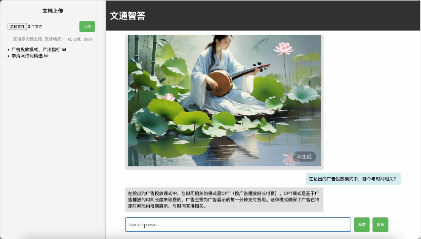

# 文通智答

[文通智答](https://github.com/Invariant64/doc-ai)是一个基于智谱平台的智能问答系统, 用户可以通过输入问题, 获取智谱平台的知识图谱中的答案.

支持多格式文档上传、在线知识库检索、文生文、文生图、语音识别等功能.

文通智答基于Python Flask框架开发, 前端使用HTML, CSS和JavaScript, 并通过SDK调用智谱平台的API.



## 项目结构

```
.
├── README.md
├── index.html
├── script.js
├── style.css
├── main.py
└── requirements.txt
```

## 安装依赖

1. 安装Python3.9
2. 安装依赖库
```shell
pip install -r requirements.txt
```
3. 将智谱平台的API KEY存入环境变量中
```shell
export ZHIPU_API_KEY=your_api_key
```
4. 语音识别功能使用Google Cloud Speech-to-Text API, 若需要在国内使用该功能, 需要使用代理, 并在`chatbot_audio_route`函数中修改代理地址
```python
    with sr.AudioFile(wave_file_path) as source:
        audio = r.record(source)
        os.environ['HTTP_PROXY'] = os.environ['HTTPS_PROXY'] = 'http://127.0.0.1:1087'
        message = r.recognize_google(audio, language='zh-CN')
        return send_message(message)
```

## 使用方法

1. 启动后端服务
```shell
python main.py
```
2. 在浏览器中打开`index.html`文件

## 基于智谱AI SDK的开发

### Python SDK安装

```shell
pip install zhipuai
```

### 创建client

在调用API之前, 需要创建一个`ZhipuAI`对象, 并传入API KEY
  
```python
from zhipuai import ZhipuAI
client = ZhipuAI(api_key="") # 请填写您自己的APIKey
```

为了API KEY的安全, 可以将API KEY存入环境变量中, 并通过`os`模块获取

```python
import os
from zhipuai import ZhipuAI
api_key = os.getenv("ZHIPU_API_KEY")
client = ZhipuAI(api_key=api_key)
```

### 模型调用

#### 同步调用

通过同步的方式调用模型, 调用后可以一次性获得返回的结果, 但是需要等待的时间较长.

```python
from zhipuai import ZhipuAI
client = ZhipuAI(api_key="") # 填写您自己的APIKey
response = client.chat.completions.create(
  model="glm-4",  # 填写需要调用的模型名称
  messages=[
    {"role": "user", "content": "作为一名营销专家，请为智谱开放平台创作一个吸引人的slogan"},
    {"role": "assistant", "content": "当然，为了创作一个吸引人的slogan，请告诉我一些关于您产品的信息"},
    {"role": "user", "content": "智谱AI开放平台"},
    {"role": "assistant", "content": "智启未来，谱绘无限一智谱AI，让创新触手可及!"},
    {"role": "user", "content": "创造一个更精准、吸引人的slogan"}
  ],
)
print(response.choices[0].message)
```

#### 流式调用

通过流式的方式调用模型, 可以在生成的内容较多时, 逐步获取返回的结果.

```python
from zhipuai import ZhipuAI
client = ZhipuAI(api_key="") # 请填写您自己的APIKey
response = client.chat.completions.create(
    model="glm-4",  # 填写需要调用的模型名称
    messages=[
        {"role": "system", "content": "你是一个乐于解答各种问题的助手，你的任务是为用户提供专业、准确、有见地的建议。"},
        {"role": "user", "content": "我对太阳系的行星非常感兴趣，特别是土星。请提供关于土星的基本信息，包括其大小、组成、环系统和任何独特的天文现象。"},
    ],
    stream=True,
)
for chunk in response:
    print(chunk.choices[0].delta)
```

#### 在线知识库调用

利用智谱AI平台的`Retrieval`工具, 可以实现对在线知识库的检索功能.

在智谱开放平台创建知识库后后得到知识库 ID，调用接口时传入知识库ID，将自动对文档进行分块、索引和存储嵌入，并通过向量搜索来检索相关内容来回答用户查询。

```python
from zhipuai import ZhipuAI
client = ZhipuAI(api_key="") # 请填写您自己的APIKey
response = client.chat.completions.create(
    model="glm-4",  # 填写需要调用的模型名称
    messages=[{"role": "user", "content": "你好！你叫什么名字"},],
    tools=[
            {
                "type": "retrieval",
                "retrieval": {
                    "knowledge_id": "your knowledge id",
                    "prompt_template": "从文档\n\"\"\"\n{{knowledge}}\n\"\"\"\n中找问题\n\"\"\"\n{{question}}\n\"\"\"\n的答案，找到答案就仅使用文档语句回答问题，找不到答案就用自身知识回答并且告诉用户该信息不是来自文档。\n不要复述问题，直接开始回答。"
                }
            }
            ],
    stream=True,
)
for chunk in response:
    print(chunk.choices[0].delta)
```

## Prompt Engineering

为了充分利用大模型对自然语言的理解能力与生成能力，实现多样化任务处理，提高大模型输出的效果，需要向大模型输入适当的提示词。提示词需要有清晰、具体的指令。

“文通智答”是同时支持文生文以及文生图功能的AI助手，为了实现这一功能，需要大模型对用户的输入进行判断，根据用户的需求决定是否需要调用知识库或文生图功能。“文通智答”的解决方案是通过一次大模型的预处理，让大模型对用户的输入进行分类，并输出一个JSON格式的结构化输出，便于程序进行进一步处理。

### First Prompt

`First Prompt`用于让大模型对用户的输入进行初步处理，分辨用户请求的种类，便于后端进一步的处理。`Frist Prompt`要求大模型返回一个JSON格式的结构化输出，其中包含了用户输入的分类信息。

```python
    def first_prompt_template(self):
        prompt = "你的身份是" \
                 "\"\"\"\n" \
                 "你是一个名为“文通智答”的文档查阅助手，你的功能是根据用户的提问从文档中提取出对应的信息，并做出回答。\n" \
                 "\"\"\"\n" \
                 "请根据用户的输入" \
                 "\"\"\"\n{{question}}\n\"\"\"\n" \
                 "生成一个 JSON 格式的输出，其中包含以下键:\n" \
                 "\"\"\"\n" \
                 "user_question: 一个字符串，表示用户的提问。\n" \
                 "user_is_greeting: 0或1，表示用户的输入是否是问候语或者是关于你的身份的提问。\n" \
                 "user_is_question_about_knowledge: 0或1，表示用户的输入是否需要某领域的知识来解答。\n" \
                 "need_image: 0或1，表示回答中是否需要包含图片。\n" \
                 "\"\"\"\n" \
                 "只需要输出 JSON 格式的回答，不需要包含额外的信息。\n"
        prompt += self.get_knowledge_prompt()
        return prompt
```

### Greeting Prompt

`Greeting Prompt`用于让大模型输出与用户打招呼的互动信息，即不需要知识库中的知识就能回复的信息。

```python
    def get_greeting_prompt(self, question):
        prompt = "你的身份是" \
                 "\"\"\"\n" \
                 "你是一个名为“文通智答”的文档查阅助手，你的功能是根据用户的提问从文档中提取出对应的信息，并做出回答。\n" \
                 "\"\"\"\n" \
                 "请你以\"文通智答\"的身份回答用户的问题" \
                 "\"\"\"\n" + question + "\n\"\"\"\n" \
                 "不要复述问题，直接开始回答。\n"
        return prompt
```

### Question Prompt

`Question Prompt`用于让大模型输出用户对知识提问的回复，其中包含了在线知识库的知识和本地文件中包含的知识。

```python
    def get_question_prompt(self, question):
        prompt = "你的身份是" \
                 "\"\"\"\n" \
                 "你是一个名为“文通智答”的文档查阅助手，你的功能是根据用户的提问从文档中提取出对应的信息，并做出回答，也可以根据用户的需求以及文档知识生成图片。\n" \
                 "\"\"\"\n" \
                 "请根据用户的问题" \
                 "\"\"\"\n{{question}}\n\"\"\"\n" \
                 "在给定的知识库中寻找答案，如果找到答案，就根据知识库中的知识回答，如果知识库中找不到答案，就根据自己的知识回答问题，并告诉用户回答不是来自文档。\n" \
                 "不要复述问题，直接开始回答。\n"
        prompt += self.get_knowledge_prompt()
        return prompt
```

### Image Prompt Prompt

`Image Prompt Prompt`是用于生成用于生成图片的提示词的提示词。该提示会让LLM根据图片提示词的格式，根据用户的输入和知识库包含的知识，输出一段详细的，用于描述图片的提示词。

```python
    def get_image_prompt(self, question):
        prompt = "你的身份是" \
                 "\"\"\"\n" \
                 "你是一个名为“文通智答”的文档查阅助手，你的功能是根据用户的提问从文档中提取出对应的信息，并做出回答，也可以根据用户的需求以及文档知识生成图片。\n" \
                 "\"\"\"\n" \
                 "请根据用户的生成图片的需求" \
                 "\"\"\"\n" + question + "\n\"\"\"\n" \
                 "以及已有的知识库中的知识生成用于生成图片的提示词，否则为空。" \
                 "提示词要求采用精确、具体的视觉描述而非抽象概念。明确、清晰的结构化提示词可以创造出更高质量的图像。" \
                 "主体: 人、动物、建筑、物体等；" \
                 "媒介: 照片、绘画、插图、雕塑、涂鸦等；" \
                 "环境: 竹林、荷塘、沙漠、月球上、水下等；" \
                 "光线: 自然光、体积光、霓虹灯、工作室灯等；" \
                 "颜色: 单色、复色、彩虹色、柔和色等；" \
                 "情绪 : 开心、生气、悲伤、惊讶等；" \
                 "构图/角度: 肖像、特写、侧脸图、航拍图等。" \
                 "不要复述问题，直接开始回答。\n"
        prompt += self.get_knowledge_prompt()
        return prompt
```

### Knowledge Prompt

`Knowledge Prompt`是其它某些提示词的一部分，这部分的提示词用于将知识库中的知识以提示词的形式输入大模型。知识包含两个部分，在线知识库中的知识和用户文档知识。

```python
    def get_knowledge_prompt(self):
        prompt = "你现在拥有的知识库包含你自带的知识库" \
                 "\"\"\"\n{{knowledge}}\"\"\"\n" 
        filesContent = self.getFilesContent()
        if filesContent:
            prompt += "和用户上传的文件" \
                      "\"\"\"\n" \
                      f"{filesContent}" \
                      "\"\"\"\n"
        else:
            prompt += "当前没有用户上传的文件。\n"
        prompt += "这些知识仅供参考，你可以根据用户的提问自由选择是否使用这些知识。\n"
        return prompt
```

## 参考资料

* [智谱AI API文档](https://open.bigmodel.cn/dev/api)
* [动手学大模型应用开发](https://datawhalechina.github.io/llm-universe)
